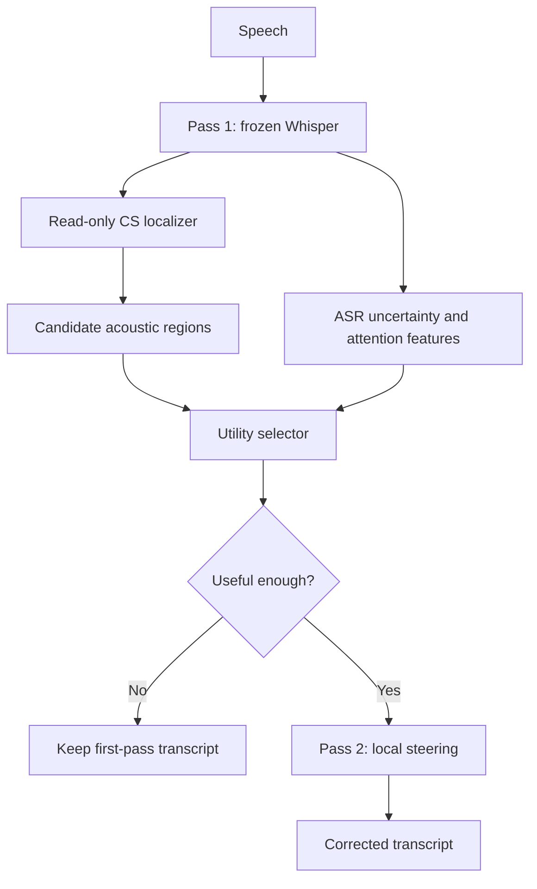

# Selective Test-Time Intervention for Code-Switching ASR
## Method-First Research Proposal and Manuscript Plan for ARR October 2026

**Version:** v5, 10 August 2026 (supersedes v4)  
**Target:** ARR October 2026 submission, 12 October 2026; intended NAACL 2027 commitment path  
**Primary model:** Whisper-large-v3 with a frozen backbone  
**Primary corpus:** CS-Dialogue, Mandarin–English spontaneous dialogue  
**Optional second corpus:** SEAME only if licensed audio is usable by 7 September 2026  
**Primary endpoint:** non-oracle, free-decoding PIER on embedded-English words  
**Paper identity:** a method-first paper on selective, span-local, test-time activation steering, supported by a compact causal study  
**Short idea:** learn **where** code-switched speech occurs and **whether** steering will help, while keeping **how** to steer fixed

---

## 0.0 Changelog for v5

v4's identity, module decomposition, and gate structure are kept. v5 closes specification gaps that would otherwise surface as reviewer objections or mid-schedule surprises.

| # | Fix | Section | Severity |
|---|---|---|---|
| 1 | LoRA "matched data" is now defined: same conversations, same hours, reported alongside parameter counts | 6-Exp4, 3.2 | **Blocking for fairness** |
| 2 | Added an off-the-shelf frame-level LID/language-diarization localizer baseline | 2.4, 6-Exp2 | **High reviewer risk** |
| 3 | Transport gate is conditional on alignment; must run on the high-confidence alignment subset | 2.8 | **Logic gap** |
| 4 | Utility-label generation cost is now costed; it is the most expensive operation in the plan | 11 | **Schedule risk** |
| 5 | Utility training set must explicitly include localizer false positives and non-CS candidates | 2.5 | Correctness |
| 6 | Deletion vs substitution stratification promoted from Analysis to required main-results reporting | 7.2, 6-Exp4 | Interpretability of D |
| 7 | Selectivity frontier requires bootstrap uncertainty bands | 7.4 | Evidence strength |
| 8 | Localizer results require ≥3 seeds with mean and spread | 6-Exp2 | Reproducibility |
| 9 | SALSA reimplementation risk mitigated with a defined cheaper fallback baseline | 6-Exp4 | **Schedule risk** |
| 10 | W5 adds a full dry-run of the locked test pipeline on `D-dev-confirm`; W6 test becomes mechanical | 10 | **No-buffer fix** |
| 11 | Attention-Guided Adaptation (ICASSP 2024) added as a required positioning target; it is the closest parameter-efficiency competitor | 1.2, 9.3-#2 | **Novelty risk** |
| 12 | Gate B pass condition given a statistical form; reference titles made explicit | 8.1, References | Precision |
| 13 | Zero-candidate utterances defined as abstentions and counted in coverage | 2.9 | Accounting |

---

## 0. What changed from v3

The previous proposal was mainly a mechanism paper: it first built a detailed encoder–decoder causal map and only later added a small practical selector. This version changes the center of the paper.

The new center is a practical inference system:

\[
\boxed{
\text{find a possible CS region}
\rightarrow
\text{predict whether intervention is useful}
\rightarrow
\text{steer only that region}
\rightarrow
\text{abstain when unsafe}
}
\]

The mechanistic experiments are still necessary, but only for three purposes:

1. show that local steering has real oracle headroom;
2. choose and freeze one corrective action;
3. generate intervention-utility labels for the selector and reject trivial explanations.

The main changes are:

| Previous v3 | Current v4 |
|---|---|
| Training-free, mechanism-first identity | Frozen-backbone, **trained-localization**, method-first identity |
| Candidate enumeration followed by a K=1 selector | A read-only temporal localizer first proposes regions; a separate utility selector decides whether to steer |
| Localizer target was not explicit | Localizer is trained on **all aligned English CS spans**, not only errors |
| Selector and span detector could be confused | Their jobs and labels are explicitly separated |
| Full two-site correctability map was central | Small E/D/ED oracle screen supports the method; the full taxonomy is secondary |
| Hard timestamp mapping for Site D | Early test of soft cross-attention transport from acoustic frames to decoder steps |
| “Permuted pairing” null | Valid within-pair language-label permutation/sign swapping; simple pair shuffling is removed because it may leave the mean direction unchanged |
| Many mechanism controls | Keep only controls that eliminate trivial alternatives to the method |
| Learned rank-one and LoRA were optional | LoRA and a learned global-steering reference become important method baselines |
| One operating threshold | The headline result is a selectivity frontier over abstention thresholds |
| Full draft during 27 Sep–3 Oct | First complete draft is moved before Interspeech; 28 Sep–1 Oct is protected from critical work |

This is not ordinary test-time adaptation. The localizer and selector are trained offline, and no model parameter is updated for a test utterance. The accurate terms are **test-time activation steering** or **inference-time intervention**.

---

## 1. Paper story in manuscript form

### 1.1 The problem

Whisper receives one utterance-level language prompt, but a code-switched utterance contains local regions from another language. A Mandarin–English utterance may therefore be mostly Mandarin while containing a short English medical, technical, or conversational expression.

Whisper may fail on the English region even when useful English-associated information exists somewhere in its hidden states. A global correction, such as forcing English for the whole utterance or fine-tuning the full model, can help the English word but can also damage Mandarin words that were already correct.

The practical problem is therefore not simply:

> Can we make Whisper more English-aware?

It is:

> Can we identify the small region where a code-switch may be confused, decide whether a fixed intervention is likely to help, and modify only that region while leaving the rest of the utterance unchanged?

### 1.2 Why existing solutions do not fully answer it

Several nearby approaches already exist:

- language-aware adapters and mixture-of-experts methods learn language-conditioned representations, but often modify broad parts of the utterance;
- **attention-guided parameter-efficient adaptation** selects language-expressive attention heads in Whisper and guides them, reaching 14.2% MER on Mandarin–English CS while training only about 5.6% additional parameters (Aditya et al., ICASSP 2024, arXiv:2312.08856). **This is the closest competitor to the parameter-efficiency half of this paper's argument and must be positioned explicitly.** The distinction is not parameter count: that method trains a modification of the model and applies it to every utterance, whereas this work keeps the correction fixed and closed-form and learns only whether and where to fire it. If the paper leans on "few trained parameters" without naming this work, the novelty claim is exposed;
- **frame-level language-adapter routing** models code-switching as latent binary sequences guiding information flow from language adapters at each adaptation point (Kulkarni et al., arXiv:2310.07423) — closest in spirit to the localizer, but it routes *adapters* rather than gating a fixed corrective direction, and it fine-tunes;
- LoRA and adapter fine-tuning can improve average recognition, but they update a much larger set of parameters and may change matrix-language behavior;
- global activation steering learns or constructs a direction and applies it broadly, but does not solve where and when the intervention should fire;
- transcript-level generative error correction acts after recognition and may lack the missing acoustic evidence;
- language identification finds English speech, but an English span does not automatically need correction.

The missing component is a selective intervention policy that separates three questions:

| Question | Component |
|---|---|
| Where is a possible embedded-English region? | Temporal CS localizer |
| Would the frozen corrective action help this region? | Intervention-utility selector |
| How should the hidden state be changed? | One fixed low-rank direction |

### 1.3 Main hypothesis

The central hypothesis is:

> A fixed language-associated rank-one direction can correct a subset of local CS errors, but practical benefit requires learning where the CS region is and whether applying that direction is useful. Selective application should retain more matrix-language and already-correct content than global steering or broad fine-tuning.

This hypothesis allows a scientifically useful negative result. Some errors may remain uncorrectable because the problem is missing acoustics, vocabulary, pronunciation, decoder history, or semantics rather than local language evidence.

### 1.4 Research questions

**RQ1 — Oracle headroom.** With reference CS boundaries, can local encoder or decoder steering correct enough English errors to justify an automatic system?

**RQ2 — Localization.** Can a lightweight read-only model find embedded-English acoustic regions, including regions that the first-pass transcript deletes or writes as Mandarin?

**RQ3 — Intervention utility.** Can a selector trained on actual intervention outcomes distinguish useful steering from harmful or unnecessary steering better than language detection or ASR uncertainty alone?

**RQ4 — Practical correction.** Under automatic localization and free decoding, does selective steering improve PIER while correcting more units than it corrupts?

**RQ5 — Selectivity.** Does the method offer a better correction–harm trade-off than global steering and a matched LoRA baseline, even if LoRA has stronger raw MER?

**RQ6 — Decoder transport, conditional.** If soft cross-attention transport is reliable, does carrying the acoustic gate to decoder steps provide extra benefit beyond encoder-only steering?

### 1.5 Intended contributions

The paper should claim four main contributions:

1. **A selective two-pass intervention system for CS-ASR.** It uses a frozen Whisper backbone, a read-only temporal CS localizer, an intervention-utility selector, one fixed low-rank corrective action, and calibrated abstention.
2. **A clean separation of where, whether, and how.** The localizer is trained on all CS spans, the selector is trained on oracle intervention outcomes, and the corrective direction is constructed separately and then frozen.
3. **A span-local encoder-to-decoder routing mechanism.** When the early transport gate passes, cross-attention softly transfers an acoustic intervention mask to decoder steps without requiring a hard DTW path.
4. **A selectivity-centered evaluation.** The main evidence reports correction, corruption, outside-span harm, monolingual retention, and the PIER–collateral-harm frontier, not only average MER/WER.

### 1.6 Claims the paper must not make

- Do not call the system training-free; the backbone is frozen, but the localizer and selector are trained.
- Do not call the direction a pure or unique language variable.
- Do not claim that every English span needs steering.
- Do not treat a frame-level LID gain as evidence of ASR correction.
- Do not treat teacher-forced gold-token improvement as transcript improvement.
- Do not claim that successful intervention proves the unmodified model normally uses exactly this direction.
- Do not claim multilingual or architecture-level generality from one model and one primary language pair.
- Do not call this conventional test-time adaptation because no parameter update occurs on each test example.

---

## 2. Proposed system: Localize, Select, and Steer

### 2.1 System overview

The system changes at most one region per utterance in Phase 1. This K=1 budget keeps the method simple, makes harms easy to attribute, and limits accidental changes.

### 2.2 Pass 1: normal frozen decoding

Run Whisper-large-v3 with normal greedy decoding. Store only inference-available information:

- selected frozen encoder states;
- the first-pass transcript;
- token or word timestamps when available;
- token confidence, entropy, and margin;
- selected cross-attention summaries;
- the default, forced-Mandarin, forced-English, and bilingual-token prompt outputs for baseline comparison.

No reference transcript or gold boundary is available to the test-time system.

### 2.3 Fixed corrective directions: how to steer

The primary method keeps the correction direction fixed across utterances. It does not generate a new vector for every span.

#### Encoder direction

At a chosen encoder layer \(l\), pool hidden states inside an aligned English span and a nearby matched Mandarin control span:

\[
x_{i,l}^{EN}=\sum_{t\in S_i^{EN}}w_{it}h_{l,t},
\qquad
x_{i,l}^{ZH}=\sum_{t\in S_i^{ZH}}w_{it}h_{l,t}.
\]

Use Hann or central-mass pooling so uncertain boundary frames receive less weight. Construct within-utterance contrasts:

\[
d_{i,l}^{E}=x_{i,l}^{EN}-x_{i,l}^{ZH}.
\]

After conversation-balanced nuisance residualization, use the paired mean:

\[
\Delta_l^E
=
\frac{\sum_i\omega_i\widetilde d_{i,l}^{E}}
{\sum_i\omega_i}.
\]

Use baseline-correct English units for construction so the positive state represents successful English recognition.

#### Decoder direction

At a selected decoder layer \(k\), use the post-cross-attention residual at the first English BPE after a Mandarin prefix, compared with a matched Mandarin continuation under the same normal prompt:

\[
d_{i,k}^{D,nat}
=
z_{k,q_i^{M\rightarrow EN}}^{postCA}(p_0)
-
z_{k,r_i^{M\rightarrow M}}^{postCA}(p_0).
\]

Estimate a small prompt-induced subspace from forced-English versus forced-Mandarin runs, then project it out:

\[
\widetilde d_{i,k}^{D\perp}
=
\left(I-U_k^{prompt}{U_k^{prompt}}^\top\right)
\widetilde d_{i,k}^{D,nat}.
\]

The decoder direction is:

\[
\Delta_k^{D\perp}
=
\operatorname{Mean}_i
\left(\widetilde d_{i,k}^{D\perp}\right).
\]

This projection prevents a local decoder result from being explained only as another global language-prompt effect.

#### Scope of the direction search

- at most four preregistered candidate layers per site;
- three primary strengths, \(\rho\in\{0.5,1,2\}\);
- paired mean as the only primary estimator;
- rank one only;
- one selected layer and strength per site;
- adjacent layers and a fourth small dose may appear only in the appendix.

This is enough to find a stable operating point without turning the paper into a large geometry study.

### 2.4 Read-only temporal localizer: where to steer

The localizer observes frozen encoder states but does not modify them:

\[
m_t=f_{loc}(h_{1:T}^E),
\qquad
m_t\approx P(t\text{ belongs to an English CS span}).
\]

The training target is **all aligned embedded-English spans**, including:

- baseline-correct spans;
- baseline-incorrect spans;
- spans deleted in the first-pass transcript;
- spans transcribed as plausible Mandarin.

This gives the localizer more and cleaner supervision than training only on errors. It also preserves the conceptual separation:

- \(m_t\) answers where English speech occurs;
- the utility selector answers whether steering will help.

#### Localizer models

Use:

1. transcript/timestamp heuristic as a non-neural baseline;
2. **off-the-shelf frame-level LID or language-diarization model**, applied without retraining;
3. linear frame classifier plus temporal smoothing as a simple learned baseline;
4. a two-layer temporal convolution over frozen encoder states as the primary localizer.

Baseline 2 is not optional. Frame-level language identification and language diarization for Mandarin–English are mature, and the first question a reviewer will ask is why an existing LID system is not sufficient as the localizer. Running it settles the question: either the trained localizer recalls materially more oracle-correctable spans, which justifies the module, or LID is adequate and the paper's novelty rests entirely on the utility selector — which is still a defensible paper, but must be written that way. Not knowing is the only bad outcome.

A small Transformer may be run only if the temporal convolution clearly underfits and schedule permits it. Do not insert an adapter that modifies the Whisper backbone; the localizer should remain an observer.

#### Localizer training

Frame-level English labels are highly imbalanced. Use:

- weighted binary cross-entropy or focal loss;
- balanced positive/negative span sampling;
- boundary-tolerant targets or label smoothing near span edges;
- conversation-disjoint training and calibration;
- threshold selection based on span recall, not frame accuracy.

After smoothing \(m_t\), threshold and merge consecutive positive frames into candidate regions \(S_1,\ldots,S_K\). Freeze minimum duration, merging gap, and maximum candidate count on development data.

The most important localization metric is:

\[
\operatorname{Recall}_{correctable}
=
P(\text{oracle-correctable span is proposed}).
\]

Normal LID F1 is secondary because the paper needs candidates that can actually be repaired.

### 2.5 Utility selector: whether to steer

For each candidate region \(S_k\), apply the already-frozen action \(a^*\) offline on the utility-training split and measure free-decoding utility:

\[
U_k(a^*)
=
N_{corrected}
-\eta N_{local\ harm}
-\kappa N_{outside\ harm}.
\]

Use \(\eta=\kappa=1\) as primary. Report \(0.5\) and \(2\) only as sensitivity values; do not retune them after inspecting outcomes.

**The utility training set must include negative candidates.** Candidates are produced by running the *frozen localizer* on `util-train`, not by reading gold spans. This is essential and easy to get wrong: if utility labels are generated only for true CS spans, the selector never sees the localizer's false positives and cannot learn to reject them — which is precisely its job at inference. The label set must therefore contain, in their naturally occurring proportions:

- candidates on baseline-incorrect English spans (the correctable target class);
- candidates on baseline-correct English spans (steering here risks corruption);
- candidates on Mandarin or non-CS regions (localizer false positives);
- candidates whose intervention produces outside-span harm.

Record the realized class proportions. If false positives are rare on `util-train` because the localizer threshold is conservative, the selector will be undertrained on exactly the cases that cause harm at a looser operating point — so generate labels at a **lower** localizer threshold than the intended operating point, and note the threshold used.

**Clarify the counting convention.** \(N_{corrected}\) counts newly correct lexical units attributable to the intervention. Under a K=1 budget with one target unit it is usually 0 or 1, while harm terms can exceed 1, so the utility distribution is asymmetric by construction. Inspect this distribution during W3 rather than discovering it at W4.

The selector learns:

\[
\widehat p_k
=
f_{util}(\phi_k)
\approx
P\big(U_k(a^*)>0\big),
\]

where \(\phi_k\) contains only inference-available features:

- localizer score and span duration;
- encoder English-language margin;
- first-pass token language/script when a token exists;
- token confidence, entropy, and top-two margin;
- encoder–decoder disagreement;
- cross-attention concentration;
- position and boundary confidence;
- a term-frequency proxy derived without test-reference access.

Use logistic regression as the simplest baseline and gradient-boosted trees as the primary selector. A small two-layer MLP is a capacity ablation, not a new proposed method.

At inference, select:

\[
k^*=\arg\max_k \widehat p_k.
\]

If \(\widehat p_{k^*}<\tau\), abstain and keep the first-pass transcript. Otherwise, steer only \(S_{k^*}\). Set \(\tau\) on a calibration split using net utility, then sweep it for the selectivity frontier.

### 2.6 Encoder-local intervention

For an accepted candidate, define the acoustic gate:

\[
g_t
=
\mathbf 1[t\in S_{k^*}]
\,m_t
\,\mathbf 1[\widehat p_{k^*}\ge\tau].
\]

Apply the fixed encoder direction:

\[
\widetilde h_{l,t}
=
h_{l,t}+\rho_E g_t\Delta_l^E.
\]

The primary method uses a fixed \(\rho_E\). The selector decides apply or abstain; it does not generate a new vector or freely tune the dose per utterance.

### 2.7 Soft cross-attention transport to the decoder

If the early transport gate passes, transfer the acoustic gate to decoder step \(q\) using selected Whisper alignment heads:

\[
r_q
=
\sum_t \overline A_{q,t}g_t,
\]

where \(\overline A\) is the frozen aggregation of preregistered cross-attention heads and layers.

Then intervene after decoder cross-attention:

\[
\widetilde z_{k,q}^{D}
=
z_{k,q}^{D}
+\rho_D r_q\Delta_k^{D\perp}.
\]

This is softer than Whisper-DTW. DTW needs a reliable hard monotonic path, while \(r_q\) only needs attention mass to be concentrated near the relevant acoustic region.

Do not normalize \(r_q\) to unit mass automatically. Preserve its attention-mass meaning and report effective intervention energy:

\[
E_{eff}
=
\rho_D^2\lVert\Delta_k^{D\perp}\rVert^2
\sum_q r_q^2.
\]

Use the same realized \(r_q\) and effective energy for every decoder control.

Cross-attention transport solves **which decoder step receives the acoustic signal**. It does not solve whether intervention is helpful; the utility selector and abstention remain necessary.

Complete deletions remain a risk because no decoder step may attend strongly to a missing region. Encoder steering is therefore the safe default.

### 2.8 Early transport gate

Test transport before building the complete decoder method.

**The transport gate is conditional on alignment, and must be read that way.** \(r_q=\sum_t\overline A_{q,t}g_t\) requires an acoustic gate \(g_t\), which requires a span, which requires the aligner currently under question. A failed transport gate therefore has two possible causes — bad attention routing or bad spans — and they must not be confounded. Run the gate on the **high-confidence alignment subset only**, and report the result stratified by alignment confidence. If transport succeeds on high-confidence spans but fails overall, the bottleneck is alignment, not routing, and the response is to repair alignment rather than to abandon Site D.

On baseline-correct development spans with known first-BPE positions, report:

- whether the gold first-BPE step is the highest-scoring or top-three step under \(r_q\);
- agreement within \(q^*\pm1\);
- attention concentration on the target span versus matched non-target spans;
- usable coverage and effective-energy distribution;
- results by deletion, substitution, and correct first-pass cases.

Freeze the alignment-head set, head aggregation, attention layer, and any sharpening using construction data only. Prefer the alignment heads used by Whisper's timestamp machinery when they are available.

If soft transport is unreliable or practical decoder coverage is below 60%, use E-only as the practical system. Site D may remain as a small oracle analysis, but it must not stay on the practical critical path.

### 2.9 Two-pass inference algorithm

For each test utterance:

1. Run normal frozen Whisper and cache inference-available features.
2. Run the temporal localizer and produce acoustic candidates. **If no candidate is produced, this is an abstention**: return the first-pass transcript and count the utterance in the abstention and coverage accounting. Report zero-candidate abstentions separately from below-threshold abstentions, because they indicate a localizer recall failure rather than a selector decision.
3. Score every candidate with the utility selector.
4. If no score passes \(\tau\), return the first-pass transcript.
5. Otherwise choose one candidate \(S_{k^*}\).
6. Run a second frozen-Whisper pass with the fixed action \(a^*\): E-only by default, or D/ED only if the transport gate passed and development evidence selects it.
7. Return the second-pass transcript without reference-based post-hoc acceptance.

The system may use a separately calibrated reference-free acceptor only as an appendix ablation. The primary result must be a true pre-intervention decision.

---

## 3. Data, splits, and leakage control

### 3.1 Primary data

Use CS-Dialogue as the main corpus because it contains natural Mandarin–English spontaneous conversations. Use conversation/session as the highest-level split unit. If one speaker appears in multiple sessions, keep all of that speaker's sessions in one role.

SEAME is optional. It is useful because it tests the same language pair on another natural CS corpus, but it must not block the paper. If licensed audio and preprocessing are not ready by 7 September, omit it and state the single-corpus limitation.

Do not substitute ViMedCSS or CS-FLEURS during the final three weeks. Vietnamese–English changes the script and detection problem, while CS-FLEURS changes spontaneous speech to read speech. Both are valuable later but would not be a clean emergency replication.

### 3.2 Five top-level data roles

| Role | Purpose | What it may tune |
|---|---|---|
| `D-construct` | Build \(\Delta^E\), \(\Delta^{D\perp}\), nuisance models, prompt subspace, and attention-head transport rule | Construction only |
| `D-dev-select` | Select one layer and strength per site; early oracle headroom | Layer and dose only |
| `D-router` | Train the localizer, generate utility labels, train the selector, and calibrate abstention | Localization and selection only |
| `D-dev-confirm` | Run specificity controls, freeze the practical action \(a^*\), and confirm the complete automatic pipeline | One final development freeze |
| `D-test` | One locked oracle and non-oracle evaluation batch | Nothing |

Split `D-router` by conversation into:

- `loc-train`: train the temporal localizer;
- `util-train`: run the frozen localizer, generate candidates and oracle intervention labels, then train the utility selector;
- `router-calib`: select the abstention threshold and probability calibration.

This prevents the utility selector from learning on candidate predictions produced by a localizer that was trained on the same conversations. If data are too small for three fixed subsets, use conversation-level cross-fitting inside `D-router`, but never create frame-level leakage.

### 3.3 Test discipline

- Reference-only counts and the frozen C00 baseline may be computed on `D-test` for power analysis.
- Do not inspect any intervened `D-test` output before every component is frozen.
- Run all locked test conditions in one scheduled batch.
- Do not change eligibility, normalization, layers, strengths, features, thresholds, head sets, or action after seeing test outcomes.
- Choose the primary versus fallback paper claim using development results only.

### 3.4 Evaluated lexical unit

Evaluate complete embedded-English lexical items, not individual BPE pieces. Freeze baseline-error and baseline-correct groups before intervention:

\[
\mathcal E_{EN}=\{u:\widehat Y_u\ne Y_u^*\},
\qquad
\mathcal C_{EN}=\{u:\widehat Y_u=Y_u^*\}.
\]

Keep token pieces from one lexical item inside the same statistical unit.

---

## 4. Reliable setup: the first non-negotiable stage

### 4.1 Why alignment is essential

Every Site-E direction, localizer label, oracle mask, and correctable-span metric depends on knowing where an English span occurs in the audio. A mechanically valid but monolingual aligner can be consistently wrong on the exact English regions of interest.

The latest smoke test is not yet a pass:

- `existing_ctc` had coverage 0.9756, monotonic validity 1.0000, and invalid rate 0.0000;
- `whisper_dtw` failed;
- the job ended `completed_no_go` because fewer than two aligners were valid.

Before locked construction:

1. identify `existing_ctc`, its training languages, tokenizer or lexicon, and English coverage;
2. replace it if it is monolingual;
3. diagnose Whisper-DTW as an implementation, attention-head, frame-rate, or time-coordinate problem;
4. obtain an independent second source, such as Qwen3-ForcedAligner or a class-balanced human boundary audit;
5. audit at least 200 units, balanced between English CS spans and matched Mandarin spans.

Required alignment checks:

- coverage at least 0.95;
- invalid or nonmonotonic rate at most 0.01;
- at least 90% of audited units usable;
- median absolute boundary error at most 100 ms;
- 90th-percentile boundary error at most 200 ms;
- English–Mandarin median boundary-error difference under 30 ms, or stable conclusions under the observed class asymmetry;
- stability to ±50 and ±100 ms boundary jitter.

If only long spans are reliable, freeze a long-span subset before steering and report its reduced coverage. Never weaken the alignment gate merely to stay on schedule.

### 4.2 Baselines that must work first

Freeze:

- audio normalization and segmentation;
- tokenizer and transcript normalization;
- greedy decoding settings;
- timestamp configuration;
- prompt \(p_0\);
- PIER, MER, and WER code;
- lexical-span scoring and correction/corruption accounting.

Run four prompt conditions:

1. normal Whisper;
2. forced Mandarin;
3. forced English;
4. concatenated Mandarin–English language-token sequence as a non-standard but important training-free reference.

Verify that the primary split has enough headroom. On `D-test`, before intervention, require enough eligible English units, baseline English errors, and conversation clusters to resolve the intended PIER effect. The previous thresholds remain sensible planning targets:

- at least 1,500 eligible embedded-English units;
- at least 500 baseline embedded-English errors;
- at least 30 conversation/session clusters;
- bootstrap minimum detectable PIER gain no larger than half the plausible oracle gain estimated on development data.

If MER is underpowered but PIER is adequately powered, keep PIER as the main endpoint and avoid a broad corpus-level MER claim.

### 4.3 Development can continue while alignment is repaired

Gate A blocks locked direction extraction and confirmatory results. It does not block engineering.

In parallel, use a small `D-construct` subset to implement:

- activation extraction and pooling;
- the linear localizer and temporal convolution;
- frame-label generation;
- candidate merging;
- the cross-attention transport diagnostic;
- utility-label and selector code with synthetic or temporary candidates;
- metric and bootstrap tests.

Do not treat prototype numbers as paper evidence.

---

## 5. Compact causal foundation

### 5.1 Oracle intervention screen

Using gold acoustic spans on development data, evaluate:

| Condition | Encoder intervention | Decoder intervention |
|---|---:|---:|
| C00 | Off | Off |
| C10 | On | Off |
| C01 | Off | On |
| C11 | On | On |

The purpose is not to build a large mechanistic taxonomy. It is to answer:

1. Is local steering capable of transcript correction?
2. Which single fixed action should the practical system use?
3. Does decoder steering add enough value to justify its mapping complexity?

Run teacher-forced diagnostics for fast screening, but choose the action from free-decoding utility. If C11 does not beat the better single site or causes more harm, do not select ED merely because it is available.

### 5.2 Valid, reduced control set

Keep controls that rule out a trivial alternative explanation:

1. **Within-pair language-label permutation.** Randomly swap EN/ZH labels inside nuisance-matched pairs, rerun residualization and aggregation, and normalize the resulting null direction. Repeat for at least five seeds. Do not merely shuffle the negative examples across pairs; the unweighted difference of means can remain unchanged under such a permutation.
2. **Matched-norm random directions.** Apply at the same location, gate, and realized energy.
3. **Opposite sign.** Apply \(-\Delta\) at the same strength.
4. **Wrong location.** Apply the correct direction to a matched Mandarin or non-target region.
5. **Global matched-energy intervention.** Spread the same total energy across the utterance instead of the selected span.
6. **Preservation controls.** Measure initially correct English spans, neighboring Mandarin, outside-span changes, and monolingual Mandarin/English performance.

For Site D, use the same realized \(r_q\) in direction controls so the comparison changes the direction rather than the routing energy.

Cut or move to the appendix:

- many direction estimators;
- a dense layer-by-layer geometry study;
- large prompt-rank sweeps;
- more than three primary dose points;
- a full E/D/ED/neither taxonomy on every split;
- extensive on-manifold or transport interpretations that do not threaten the method claim.

### 5.3 What counts as oracle headroom

Proceed to the full automatic method only if development data show:

- positive local free-decoding PIER gain;
- corrections exceed corruptions;
- the correct direction beats the label-permuted, random, sign, and wrong-location controls;
- the effect appears at two neighboring non-extreme strengths or is stable around the selected dose;
- at least one fixed action in \(\{E,D,ED\}\) has useful net utility.

If no oracle action has positive net utility, stop the method pipeline. A localizer cannot rescue an intervention that does not work under perfect localization.

---

## 6. Experiments required for the paper

### Experiment 0 — Alignment, baseline, and headroom

**Question:** Is the evaluation trustworthy and sufficiently powered?

**Run:**

- two-source alignment validation;
- class-balanced boundary audit;
- normal and three language-prompt baselines;
- reference-only counts and MDE;
- PIER/MER/WER implementation checks.

**Report:** coverage, boundary errors by language, eligible units, error counts, cluster count, baseline PIER/MER/WER, and MDE.

**Why it matters:** every later local claim is invalid if the English spans are not aligned reliably.

### Experiment 1 — Oracle steering headroom and action selection

**Question:** Can fixed local steering repair real CS errors?

**Run:**

- E-only, D-only, and ED oracle-local intervention;
- at most four layers and three strengths per site during selection;
- free-decoding utility;
- label-permuted, random, opposite-sign, wrong-location, and global controls;
- prompt projection for every Site-D claim.

**Report:** oracle PIER gain, correction/corruption, outside-span harm, action overlap, selected action \(a^*\), and control differences with conversation-block CIs.

**Decision:** if oracle headroom fails, do not spend the remaining schedule on the learned selector.

### Experiment 2 — CS-span localizer

**Question:** Can the method find possible English regions without relying on a correct transcript?

**Compare:**

1. transcript/timestamp heuristic;
2. off-the-shelf frame-level LID / language diarization, no retraining;
3. linear frame classifier plus smoothing;
4. two-layer temporal convolution.

**Seeds:** report the learned localizers over at least three seeds with mean and spread. A single-seed neural result invites an obvious objection and costs almost nothing to avoid.

**Report:**

- frame F1 and AUPRC;
- span precision and recall at a frozen IoU tolerance;
- median boundary error;
- candidate count per utterance;
- recall of baseline English errors;
- recall of deleted or Mandarin-substituted English spans;
- recall of oracle-correctable spans.

**Main success criterion:** at least 70% recall of oracle-correctable spans at a candidate load the K=1 utility stage can handle. If this fails, the main bottleneck is candidate recall, not utility scoring.

### Experiment 3 — Utility selector and abstention

**Question:** Does learning from intervention outcomes improve safety over simple language or uncertainty signals?

**Compare:**

1. steer every detected English span;
2. uncertainty-only selector;
3. language/localizer-only selector;
4. full intervention-utility selector;
5. full selector with calibrated abstention.

**Report:** AUROC/AUPRC for positive utility, calibration error, coverage, abstention, corrected and corrupted counts, expected utility, and the fraction of oracle gain retained.

**Required result:** at some nontrivial coverage, the full utility selector must improve net utility over steering every localized span and over uncertainty alone.

### Experiment 4 — Main non-oracle system comparison

**Question:** Does the complete method improve real free-decoding CS-ASR?

**Required systems:**

1. frozen Whisper;
2. forced-Mandarin, forced-English, and bilingual-token prompts;
3. global fixed steering;
4. predicted localization with steer-all;
5. predicted localization plus utility-aware selective steering;
6. oracle localization and oracle utility as upper bounds;
7. matched-data LoRA;
8. SALSA-style or equivalent learned global rank-one steering with a frozen backbone.

A separate conventional adapter is optional if LoRA and learned global steering are already implemented well. Contextual biasing and LLM generative error correction are related-work comparisons, not required primary experiments, because they introduce external term lists or language models that change the information available to the system.

**Define "matched-data LoRA" precisely, or the comparison is not defensible.** LoRA must be trained on **exactly the conversations used to train the localizer and selector** (`loc-train` ∪ `util-train`), never on `D-dev-confirm` or `D-test`. Report for every trained system: audio hours, number of conversations, trainable parameters, wall-clock training time, and peak memory. Without this, a reviewer cannot tell whether a LoRA advantage comes from method or from data, and the parameter-efficiency argument collapses.

**Fallback for the learned-global-steering baseline.** Reimplementing a SALSA-equivalent system from scratch is a real schedule risk on this timeline. If it is not running by the end of W4, substitute a defined cheaper equivalent: **train a rank-one steering vector with transcript cross-entropy on the same matched data, apply it globally to all frames at the selected layer.** This is a faithful "learned global steering" baseline, isolates *learned vs closed-form* and *global vs local* as separate axes, and reuses infrastructure already built for the fixed direction. State clearly in the paper which variant was run.

**Stratify the main results by error type.** Report PIER, correction, and corruption separately for **deletions** and **substitutions**. This is not an analysis nicety: Site D can only act at a decoder step that exists, so a deleted English word is structurally outside its reach, and a pooled D result averages a mechanism that cannot fire with one that can. The same stratification is what demonstrates the temporal localizer's value, since a deletion leaves no first-pass token for a transcript heuristic to enumerate from.

**Main metrics:** PIER, MER, WER, correction rate, corruption rate, outside-span harm, Mandarin retention, coverage, abstention, parameters, training cost, and two-pass latency.

**Headline figure:** sweep the abstention threshold and plot:

\[
\Delta\operatorname{PIER}
\quad\text{versus}\quad
\operatorname{CollateralErrorRate}.
\]

The proposed system should occupy a useful point on this frontier. It does not need to beat LoRA in raw MER if it clearly preserves more matrix-language and already-correct content. If LoRA dominates accuracy, retention, parameters, and latency simultaneously, the method claim becomes weak.

### Experiment 5 — Ablations that explain the method

Keep only the ablations that test a component of the proposed system:

- heuristic versus linear versus temporal localizer;
- steer-all versus utility selection;
- utility features with and without the language margin;
- local versus global steering;
- oracle versus predicted mask;
- E-only versus D-only versus ED when transport passes;
- closed-form fixed direction versus learned global steering;
- fixed binary intervention strength versus utility-scaled strength as an optional appendix result.

Do not add rank-4, dynamic per-example vectors, or a full adapter family in Phase 1.

### Experiment 6 — Preservation and efficiency

**Question:** Is selective steering useful because it changes less of the model's behavior?

Report:

- errors introduced on initially correct English spans;
- errors introduced on neighboring Mandarin words;
- transcript changes outside the selected window;
- monolingual Mandarin and English WER;
- number of trained parameters in localizer + selector + any learned direction;
- localizer and selector training time;
- first-pass and two-pass real-time factors;
- peak memory;
- percentage of utterances that use the second pass.

Parameter accounting must be honest. Compare all trained components of the proposed method against all trained LoRA parameters.

### Experiment 7 — Optional same-pair transfer

If SEAME is ready by 7 September, freeze the CS-Dialogue procedure and test it on SEAME with only corpus-specific normalization and direction reconstruction that was defined in advance. Clearly state what is transferred and what is reconstructed.

If SEAME is unavailable, submit the complete single-corpus study. Do not rush a different language pair into the critical path.

---

## 7. Metrics and statistics

### 7.1 Primary endpoint

The primary endpoint is PIER on eligible embedded-English lexical units under predicted localization, utility-aware abstention, K=1 intervention, and free decoding:

\[
\Delta\operatorname{PIER}
=
\operatorname{PIER}_{baseline}
-
\operatorname{PIER}_{method}.
\]

Positive values mean improvement.

### 7.2 Required secondary outcomes

\[
\operatorname{CorrectionRate}
=
P(\widetilde Y_u=Y_u^*\mid u\in\mathcal E_{EN}),
\]

\[
\operatorname{CorruptionRate}
=
P(\widetilde Y_u\ne Y_u^*\mid u\in\mathcal C_{EN}).
\]

Also report:

- **all primary outcomes stratified by deletion versus substitution** (required, not optional — see Experiment 4);
- MER and overall WER;
- corrected-to-corrupted ratio;
- outside-span new errors;
- Mandarin and monolingual retention;
- localizer recall of correctable spans;
- selector coverage, abstention, precision, calibration, and expected utility;
- fraction of oracle PIER gain retained;
- runtime and trained parameters.

### 7.3 Statistical unit

- block bootstrap by conversation/session;
- 10,000 resamples for final intervals;
- paired 95% confidence intervals for primary comparisons;
- keep all pieces of one lexical unit together;
- report distributions across conversations, not only pooled means;
- separate development selection estimates from locked test estimates.

For the specificity claim, compare the correct intervention directly against every required null using paired bootstrap differences.

### 7.4 Selectivity frontier

The main figure sweeps \(\tau\), the selector abstention threshold. Each point reports:

- PIER improvement;
- collateral error rate;
- coverage;
- corrected-to-corrupted ratio.

Mark the threshold chosen on `router-calib`. Do not select a new threshold from the test curve.

**The frontier needs uncertainty.** A curve without a band is weak evidence, and this figure carries the paper's main claim. Resample conversations with the block bootstrap, recompute the entire frontier per resample, and plot a pointwise band. Report the corresponding band for every comparison system on the same axes; if the proposed method's band overlaps global steering's across the whole sweep, the selectivity claim is not supported regardless of where the chosen operating point sits.

---

## 8. Development gates and preregistered claims

### 8.1 Decision gates

| Gate | Question | Pass condition | Response if it fails |
|---|---|---|---|
| A — Alignment | Are local frame labels trustworthy? | Coverage, boundary, class-asymmetry, and jitter checks pass | Repair alignment or restrict to the frozen reliable subset |
| B — Oracle headroom | Does any fixed local action repair enough errors? | Free-decoding net utility positive with a conversation-block bootstrap 95% CI excluding zero, corrections exceeding corruptions, and the correct direction beating every required null in paired bootstrap contrasts | Stop the automatic method; no detector can rescue a useless action |
| T — Decoder transport | Can the acoustic gate reach decoder steps reliably? | At least 60% practical coverage with useful target-step concentration | Use E-only for the practical system |
| C — Localizer recall | Does candidate generation include repairable spans? | At least 70% recall of oracle-correctable spans at manageable candidate load | Report localization as the bottleneck; do not overclaim utility selection |
| D — Utility value | Does outcome supervision beat steer-all and uncertainty? | Better net utility at nontrivial coverage on development data | Simplify to local steer-all or weaken the selector claim |
| E — Automatic method | Does predicted steering retain useful oracle gain with low harm? | Positive development PIER gain and corrections exceed corruptions | Use the preregistered fallback claim |
| F — Method comparison | Is the selectivity point competitive with LoRA/global steering? | Proposed method is non-dominated on correction versus harm or preservation | Raw method claim is weak; reframe or improve before test |

### 8.2 Claims chosen before test

**Primary claim**

> Predicted localization plus utility-aware sparse steering improves embedded-English recognition in frozen Whisper while correcting more spans than it corrupts and preserving matrix-language recognition.

**Supporting claim**

> Intervention-utility supervision gives a better correction–harm trade-off than steering every detected CS span or using ASR uncertainty alone.

**Mechanism-support claim**

> A fixed language-associated direction has location- and direction-specific oracle corrective leverage for a subset of natural CS errors.

**Fallback claim**

> Oracle-local intervention shows meaningful correctability, but the oracle-to-automatic gap identifies CS-region localization or utility estimation as the main practical bottleneck.

Choose the primary or fallback paper scope using `D-dev-confirm`, then freeze the whole pipeline before running `D-test`. Do not choose the story after seeing test results.

### 8.3 Outcomes that change the paper

| Development result | Manuscript consequence |
|---|---|
| E and automatic routing work; D transport fails | Submit an encoder-local selective intervention paper; keep D as a small oracle limitation |
| E and D both work | Present cross-attention transport as a second methodological contribution |
| Oracle works; localizer recall is poor | Fallback paper on the localization ceiling; automatic claim is limited |
| Localizer recalls spans; utility selector fails | Show that English identity and intervention usefulness differ, but practical method is not established |
| Random or label-permuted directions match the method | Abandon the language-associated direction claim |
| LoRA wins raw MER but causes more collateral harm | Lead with the selectivity and preservation frontier |
| LoRA dominates every axis | Method contribution is not yet strong enough without another clear advantage |
| Oracle steering has no net benefit | Stop this paper direction before building the remaining modules |

---

## 9. Manuscript structure

The proposal is organized so that each experimental stage becomes a paper section.

### 9.1 Suggested title

Primary working title:

> **Selective Test-Time Intervention for Code-Switching Speech Recognition**

More descriptive alternative:

> **Learn Where and Whether to Steer: Selective Test-Time Intervention for Code-Switching ASR**

Avoid a title that promises broad mechanistic interpretability or a universal language direction.

### 9.2 Abstract logic

Write the abstract in five moves:

1. **Problem:** global language prompting and broad adaptation can damage non-target speech in code-switched ASR.
2. **Gap:** an embedded-language span is not automatically an error, so practical steering must determine both location and utility.
3. **Method:** frozen Whisper + read-only temporal localizer + oracle-trained utility selector + fixed rank-one local intervention + abstention.
4. **Evidence:** automatic free-decoding PIER, correction/corruption, preservation, selectivity frontier, and comparison with global steering and LoRA.
5. **Conclusion:** selective routing recovers a useful fraction of oracle correction with less collateral change, or state the preregistered oracle-to-automatic bottleneck finding if the practical gate fails.

### 9.3 Section-by-section manuscript flow

#### 1. Introduction

Explain:

- why short English regions are difficult inside Mandarin speech;
- why global prompts and broad fine-tuning are blunt tools;
- why detecting English is different from knowing intervention will help;
- the “where, whether, how” decomposition;
- the four contributions from §1.5.

End with the primary research question and a one-paragraph system overview.

#### 2. Related Work

Organize by problem, not by a long paper list:

1. code-switching ASR and language-aware adaptation;
2. frozen-model activation steering in speech models, including SALSA and accent steering;
3. frame-level language routing and language adapters;
4. Whisper prompting and local/global language control;
5. test-time adaptation versus offline-trained inference control;
6. transcript-level generative error correction.

State the novelty boundary clearly:

> Prior work learns or applies corrective representations; this work keeps a low-rank correction fixed and learns where and whether it can be safely applied.

#### 3. Method

Use this order:

1. task and notation;
2. fixed encoder and prompt-orthogonal decoder directions;
3. read-only temporal localizer;
4. intervention-utility label generation;
5. selector and abstention;
6. encoder steering;
7. optional cross-attention transport and decoder steering;
8. two-pass algorithm.

This order makes the method readable: the reader first learns how the correction is defined, then how its target and use are chosen.

#### 4. Experimental Setup

Include:

- CS-Dialogue and conversation-disjoint roles;
- Whisper-large-v3 and frozen-backbone statement;
- alignment validation;
- prompt, global steering, LoRA, and learned-steering baselines;
- localizer and selector architectures;
- PIER/MER/WER and harm metrics;
- bootstrap statistics;
- test-set lock and development decision gates.

#### 5. Oracle Feasibility and Specificity

Answer RQ1:

- oracle E/D/ED headroom;
- selected fixed action;
- required null controls;
- prompt deconfounding for Site D;
- brief transport gate result.

Keep this section compact. It exists to justify the system, not to become the paper's identity.

#### 6. Automatic Localization and Utility Prediction

Answer RQ2 and RQ3:

- heuristic, linear, and temporal localizer;
- correctable-span recall;
- steer-all, uncertainty, language-only, and utility-aware selection;
- calibration and coverage.

Emphasize the candidate recall ceiling: the selector cannot recover a span that the localizer never proposes.

#### 7. Main Selective-Intervention Results

Answer RQ4 and RQ5:

- proposed non-oracle free-decoding result;
- selectivity frontier;
- oracle gap;
- comparison with prompts, global steering, learned global steering, and LoRA;
- correction/corruption and preservation.

This is the paper's main results section.

#### 8. Analysis

Keep only focused analysis:

- which error types are correctable;
- deletion versus substitution behavior;
- why the system abstains;
- E-only versus transported D/ED if transport passes;
- failure examples and outside-span changes.

Do not add a separate representation-geometry section.

#### 9. Limitations and Conclusion

State:

- one model, one primary corpus, and one main language pair;
- K=1 caps recall and corpus-level gain;
- the method trains a localizer and selector even though the backbone is frozen;
- the correction is rank one and shared across examples;
- residual alignment error limits locality claims;
- successful intervention does not prove normal internal use of the direction;
- Site D depends on cross-attention transport and may miss deletions;
- SEAME, if absent, leaves same-pair generalization untested;
- LLM GER and contextual biasing are not matched-information primary baselines.

### 9.4 Main tables and figures

| Item | Content | Main question answered |
|---|---|---|
| Figure 1 | Two-pass Localize–Select–Steer system | What is the method? |
| Table 1 | Data, alignment by language, baselines, and headroom | Is the setup reliable? |
| Table 2 | Oracle E/D/ED headroom plus required nulls | Does fixed local steering work specifically? |
| Table 3 | Localizer and correctable-span recall | Can the system find repairable regions? |
| Table 4 | Utility-selector ablation | Does “whether” add value beyond “where”? |
| Figure 2 | PIER improvement versus collateral error rate | Is the method selective? |
| Table 5 | Main comparison: Whisper, prompts, global steering, LoRA, learned steering, proposed, oracle | Does the complete system work? |
| Table 6 | Preservation, parameters, and latency | What is the deployment trade-off? |
| Optional Table 7 | SEAME frozen-procedure transfer | Does it generalize to a second natural corpus? |

Appendix:

- all layer and dose results;
- attention-head transport details;
- boundary jitter and class asymmetry;
- all random and label-permutation seeds;
- full prompt outputs;
- selector features and calibration;
- per-conversation bootstrap details;
- complete hyperparameters and exclusion flow.

### 9.5 Evidence-to-claim map

| Claim | Minimum evidence |
|---|---|
| Fixed direction has local corrective leverage | Oracle gain plus label-permuted, random, sign, and wrong-location controls |
| Temporal localizer adds real recall | Deleted/substituted-span and oracle-correctable-span recall above transcript heuristic |
| Utility labels are necessary | Full selector beats steer-all, language-only, and uncertainty-only at matched coverage |
| Method improves CS-ASR | Locked non-oracle PIER CI above zero with correction greater than corruption |
| Method is selective | Favorable PIER–harm frontier and stronger retention than global steering or LoRA at a useful operating point |
| Decoder transport helps | Frozen attention mapping passes early gate and D/ED adds benefit beyond E-only without extra global-language shift |

---

## 10. Week-by-week execution to 12 October 2026

The schedule assumes work starts on 10 August. It moves the first full manuscript earlier because Interspeech 2026 runs 28 September–1 October, with poster responsibilities on 30 September and 1 October.

| Period | Main work | Locked output |
|---|---|---|
| **W0: 10–16 Aug** | Identify the CTC aligner; diagnose Whisper-DTW; freeze data roles, normalization, candidate layers, pooling, metrics, and baselines; implement localizer/selector skeletons; run 200-utterance compute pilot | Reproducible baseline and written Gate-A audit plan |
| **W1: 17–23 Aug** | Complete ≥200-unit class-balanced alignment audit; run soft cross-attention transport pilot; create frozen caches; train linear localizer prototype; construct locked E/D directions only after Gate A | Gate A decision; transport rule or early E-only fallback |
| **W2: 24–30 Aug** | Oracle layer/dose screen; E/D/ED free-decoding headroom; begin label-permutation/random/wrong-location controls; train temporal localizer on `loc-train` | Gate B preliminary decision; primary localizer frozen |
| **W3: 31 Aug–6 Sep** | Finish required controls on `D-dev-confirm`; freeze action \(a^*\); start matched LoRA and learned-global-steering baselines; inspect early utility distribution | Scientific action frozen; no more direction/site tuning |
| **W4: 7–13 Sep** | SEAME go/no-go on 7 Sep; run frozen localizer on `util-train`; generate intervention-utility labels; train logistic/GBM selector; begin Methods and Setup writing | Utility selector models and clean label audit |
| **W5: 14–20 Sep** | Calibrate threshold on `router-calib`; compare steer-all, uncertainty, language-only, and utility-aware selection; build development selectivity frontier; choose primary or fallback claim; **run a full dry-run of the locked test pipeline on `D-dev-confirm`** | Gate C–F decisions; complete pipeline frozen before test; dry-run passes end to end |
| **W6: 21–27 Sep** | One locked `D-test` batch (mechanical execution of the dry-run script, no new code); finalize main baselines, bootstrap CIs, tables, and Figure 2; write first complete manuscript draft | Locked results and full draft before travel |
| **Protected travel: 28 Sep–1 Oct** | Interspeech conference and poster sessions; no critical experiment or pipeline dependency | Only lightweight notes or coauthor feedback if available |
| **W7: 2–5 Oct** | Integrate feedback; finish Results, Analysis, Related Work, limitations, appendix, and reproducibility package | Submission-ready scientific content |
| **W8: 6–11 Oct** | Internal review, anonymization, formatting, reference audit, code/supplement check, author and reviewer-registration preparation | Final anonymous package |
| **12 Oct** | Submit to ARR | Submission complete |

### 10.0 Why W5 ends with a dry-run

The schedule has no recovery week: W7 is four days and W6 is the last week before travel. If the locked `D-test` batch in W6 hits a bug, there is no time to fix it and rerun.

The dry-run removes this risk. In W5, execute the **entire** locked test protocol on `D-dev-confirm` — every system, every metric, every bootstrap, every table and figure generated end to end by script. W6 then re-runs the identical script with the test split substituted. Nothing is written in W6 except the split path.

This also protects test discipline. A test run that requires new code is a test run where implementation decisions get made after the data is visible; a mechanical rerun cannot leak in that way.

### 10.1 Drop order if time slips

Drop in this order:

1. SEAME transfer;
2. small-MLP selector capacity ablation;
3. adjacent-layer and fourth-dose appendix checks;
4. optional conventional adapter;
5. nonessential qualitative examples.

Do not drop:

- alignment validation;
- oracle headroom;
- valid label-permutation and matched-random controls;
- prompt deconfounding for any Site-D claim;
- read-only localizer evaluation;
- utility-gating comparison with steer-all and uncertainty;
- LoRA and learned global-steering reference;
- locked non-oracle free decoding;
- correction/corruption and preservation;
- selectivity frontier;
- conversation-block confidence intervals.

If alignment repair consumes an extra week, drop every optional item immediately. Do not weaken the alignment threshold.

---

## 11. Compute and implementation plan

Run a local 200-utterance benchmark before scheduling full experiments. Measure:

- teacher-forced examples per second with hooks;
- free-decoding real-time factor;
- localizer inference time;
- second-pass cost at expected coverage;
- GPU peak memory;
- pooled activation-cache size;
- cross-attention summary size;
- host-transfer overhead.

### 11.1 Utility-label generation is the largest single cost

This is the operation most likely to break the schedule, and v4 did not cost it. Generating \(U_k(a^*)\) requires **one free-decoding second pass per candidate**, not per utterance:

\[
\text{passes} \approx N_{\text{util-train utterances}} \times \overline{K}_{\text{candidates per utterance}}.
\]

At 3–5 candidates per utterance over a few thousand utterances this is tens of thousands of free-decoding passes — the dominant compute item in the whole project, larger than every teacher-forced sweep combined and larger than LoRA training.

Mitigations, decided in W0 from the pilot measurement:

- cap candidates per utterance during label generation (a preregistered maximum, reported);
- batch second passes aggressively; free decoding batches poorly by default, so this needs implementation attention early;
- restrict the second pass to a bounded token window around the candidate where the decoding implementation permits it;
- if the measured cost exceeds the W4 budget, reduce `util-train` conversations rather than reducing candidates per utterance — shrinking \(\overline K\) biases the selector's training distribution toward easy cases, while shrinking the conversation count only costs sample size.

Measure this explicitly in the W0 pilot: time one full localize-then-second-pass cycle on 200 utterances and extrapolate before committing to the `util-train` size.

Cache only what the method needs:

- selected encoder layer states or pooled local windows;
- matched construction-span states;
- selected post-cross-attention decoder states;
- prompt-counterfactual pooled states;
- first-pass confidence and timestamp metadata;
- compact selected-head attention summaries;
- hashes of model, data split, normalization, and code version.

Do not cache every frame from every layer for every utterance. The project is now a selective-method study, not a full representation atlas.

---

## 12. ARR submission sufficiency

### 12.1 Is this flow enough to construct a full manuscript?

**Yes—if every P0 experiment is completed and the development gates support the primary claim, this flow is enough to produce a coherent ARR long-paper manuscript.** It provides:

- a clear practical problem;
- a method with distinct, necessary components;
- a novelty boundary against adapters, LoRA, and global steering;
- reliable data and alignment controls;
- an oracle upper bound;
- a complete non-oracle inference path;
- strong method baselines;
- ablations for every claimed component;
- safety, preservation, efficiency, and statistical evaluation;
- a preregistered fallback if automatic localization is the bottleneck.

Following the plan is not a guarantee of acceptance. ARR reviewers judge the strength of the resulting evidence, not the completeness of the checklist. The paper is strong enough to submit only if the key results support a meaningful claim.

### 12.2 Minimum result pattern for a strong method paper

The strongest submission pattern is:

1. oracle local steering shows clear, direction-specific headroom;
2. the temporal localizer recalls substantially more repairable spans than transcript heuristics;
3. utility-aware gating beats steer-all and uncertainty-only selection;
4. automatic PIER improves with a confidence interval above zero;
5. corrections exceed corruptions;
6. the method retains useful oracle gain;
7. the selectivity frontier is better than global steering and offers a preservation advantage relative to LoRA;
8. matrix-language, outside-span, and monolingual harm remain small;
9. all decisions were made before the locked test run.

SEAME strengthens generalization but is not mandatory for a defensible single-corpus paper if all nine items above are strong and the limitation is explicit.

### 12.3 Result patterns that are still submittable but weaker

**E-only works; decoder transport fails.** Still a coherent method paper. Remove decoder transport from the headline and present it as a failed conditional branch.

**Oracle works; automatic method keeps only a small fraction of the gain.** Potential fallback paper on the localization or utility bottleneck, but weaker as a practical intervention paper. It needs a careful oracle-to-automatic gap analysis.

**LoRA has better raw MER, but selective steering causes much less harm.** Still defensible if the selectivity frontier clearly shows a useful deployment trade-off.

**Single corpus only.** Submittable with a direct limitation, but reviewers may question generalization. Strong conversation-disjoint statistics and preservation evidence become more important.

### 12.4 Results that mean the paper is not ready in this form

- alignment Gate A does not pass;
- oracle local steering has no positive net utility;
- random or label-permuted controls work as well as the proposed direction;
- predicted localization misses most oracle-correctable spans;
- utility gating does not improve over steer-all or uncertainty;
- automatic correction does not exceed corruption;
- LoRA or global steering dominates both recognition and preservation without a compensating efficiency or selectivity advantage;
- the primary claim is chosen after inspecting the test outcomes.

If one of these occurs, adding more tables will not fix the scientific gap. The claim or method must change.

### 12.5 Final verdict

This revised proposal is sufficient as the complete research-to-manuscript blueprint for ARR October 2026. The paper's coherent contribution is:

\[
\boxed{
\text{learn where CS speech occurs}
+
\text{learn whether intervention helps}
+
\text{keep how to intervene fixed}
}
\]

The experimental core is:

\[
\boxed{
\text{reliable alignment}
\rightarrow
\text{oracle headroom}
\rightarrow
\text{read-only localizer}
\rightarrow
\text{utility selector}
\rightarrow
\text{selective second pass}
\rightarrow
\text{locked selectivity evaluation}
}
\]

If this core succeeds, it directly fills the Introduction, Method, Experimental Setup, Results, Analysis, and Limitations sections. No separate large mechanistic-interpretability program is required for the October manuscript.

---

## 13. Immediate actions

1. Identify the exact `existing_ctc` model and verify Mandarin and English coverage.
2. Diagnose Whisper-DTW and immediately test soft cross-attention transport on baseline-correct aligned spans.
3. Freeze the five top-level data roles and the three conversation-disjoint `D-router` subsets.
4. Freeze transcript normalization, prompts, metrics, pooling weights, candidate layers, and primary strengths.
5. Run the 200-utterance compute and storage benchmark.
6. Complete the class-balanced ≥200-unit alignment audit.
7. Build the linear localizer and temporal-convolution localizer in parallel with alignment repair.
8. After Gate A, construct the locked encoder and prompt-orthogonal decoder directions.
9. Run the oracle E/D/ED headroom and required null controls before generating utility labels.
10. Start the matched LoRA and learned-global-steering baselines by W3, not after the main test.
11. Draft the Method and Experimental Setup sections during W4–W5 so the first full paper exists before Interspeech.
12. Check the ARR October author-registration date as soon as it changes from TBA; all authors should prepare current OpenReview profiles and reviewing eligibility information.

---

## References and planning links

- [ACL Rolling Review dates](https://aclrollingreview.org/dates) — October 2026 submission deadline: 12 October 2026; cycle end: 20 December 2026.
- [ARR Call for Papers and reviewing requirements](https://aclrollingreview.org/cfp) — all authors must complete the cycle's registration process after submission unless an exemption applies.
- [CS-Dialogue](https://arxiv.org/abs/2502.18913) — primary natural Mandarin–English dialogue corpus.
- [Whisper](https://proceedings.mlr.press/v202/radford23a.html) — primary frozen encoder–decoder backbone.
- [SALSA](https://arxiv.org/abs/2606.00460) — closest learned steering comparison and novelty boundary.
- [Adapting the adapters for code-switching in multilingual ASR](https://arxiv.org/abs/2310.07423) — Kulkarni, Kulkarni, Couceiro & Aldarmaki. Models code-switching as latent binary sequences guiding frame-level information flow from language adapters; closest prior work to the localizer concept, but it routes adapters and fine-tunes rather than gating a fixed direction.
- [Attention-Guided Adaptation for Code-Switching Speech Recognition](https://arxiv.org/abs/2312.08856) — Aditya, Rohmatillah, Tai & Chien, ICASSP 2024. Selects language-expressive attention heads in Whisper; reports 14.2% MER on Mandarin–English CS while training about 5.6% additional parameters. **Closest parameter-efficiency competitor; must be positioned explicitly in Related Work.**
- [Adapting Whisper for Code-Switching through Encoding Refining and Language-Aware Decoding](https://arxiv.org/abs/2412.16507) — Whisper adapted at both encoder and decoder with language-aware adapters; the trained two-site counterpart to this work's frozen two-site design.
- *Language-informed test-time adaptation* (arXiv:2408.05769) — **UNVERIFIED.** Confirm the exact title, authors, and venue before submission, or remove. Two citation errors have already occurred in this document lineage; every reference should be checked against the arXiv abstract page rather than from memory.
- [Adapting OpenAI's Whisper for Code-Switch Mandarin-English SEAME and ASRU2019](https://arxiv.org/abs/2311.17382) — examines language-ID prompt configurations for Whisper on CS; directly relevant to the four prompt baselines in §4.2.
- [Representation Fine-Tuning](https://proceedings.neurips.cc/paper_files/paper/2024/hash/75008a0fba53bf13b0bb3b7bff986e0e-Abstract-Conference.html) — learned representation-level intervention background.
- [Is This the Subspace You Are Looking for?](https://arxiv.org/abs/2311.17030) — caution that successful activation intervention does not by itself prove normal use of the intervened direction.
